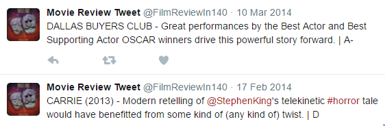

##Our Project

In response to a tweet reviewing a movie, recommend a movie based on:

- ratings in the MovieLens Database 

- overall twitter reviews of the initial movie

##Data Sources

- Twitter feed @FilmReviewIn140 : for initial tweets

##Data Sources
- General twitter search (I rated 'movie-name' #imdb)

##Data Sources
- Standford's large movie review dataset (http://ai.stanford.edu/~amaas/data/sentiment/) : to train sentiment analysis model

-- several text files identifed as positive or negative movie reviews

- Movielens large database (https://grouplens.org/datasets/movielens/): to select the top 10 rated movies (based on genre)

-- multiple zipped csv files (for project used movies and ratings)

##Process
The process to Recommend was as follows:

##Results - Sentiment Analysis
- Tested Accuracy against the letter grade assigned to each review
- Achieved 75% accuracy

##Result - Recommendation
Godzilla (2014) had negative sentiment and is tagged with the following genres:
Action|Adventure|Sci-Fi|IMAX

gave rise to the following selections from movielens database:

##Result - Recommendation
And the top 3 with respect to twitter popularity were:

##Another Result - Recommendation
Olympus Has Fallen had a positive sentiment and is tagged with the following genres:
Action|Thriller

gave rise to the following selections from the movielens database:

##Another Result - Recommendation
And the top 3 with respect to twitter popularity were:

##Challenges
- How to analyse sentiment?

-- Solved by using additional dataset maintained by Standford University to train a prediction model

- How to find tweets with reviews?

-- Solved by using a particular twitter handle which had tweets in particular format

-- For choosing top three searched for particular phrasing of "I rated movie #imdb"

- For general searches twitter API only gives access to tweets going back one week.

##Conclusion
- Project enabled an exploration of recommendation systems where not much is known about the person recommending to (other than one tweet).

- Project helped to understand how to get data from twitter 

- Project allowed exploration of text analysis including sentiment analysis

- Further improvements include analysing additional meta data about the movie such as Directors, Actors, Producers, and even plot analysis for bettter recommendation

##Questions
THANK YOU